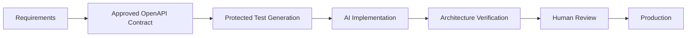
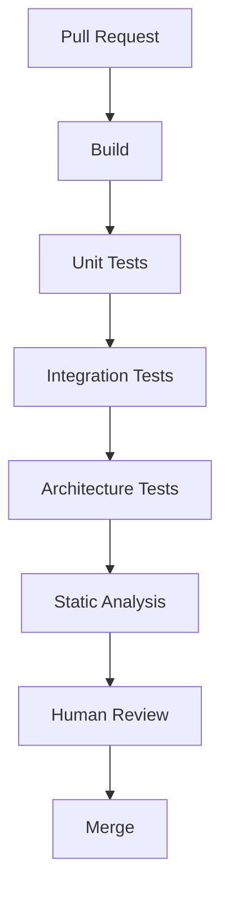

# GuardRail

> Deterministic verification for AI-assisted software development.

---

# Motivation

AI coding assistants have fundamentally changed software development.

Generating thousands of lines of syntactically correct code now takes minutes.

Reviewing those thousands of lines still requires human attention.

As AI generation becomes cheaper, human verification becomes the new bottleneck.

GuardRail explores a different approach.

Rather than relying primarily on human reviewers to verify generated code, GuardRail shifts deterministic verification earlier into the development lifecycle.

The objective is simple:

> Automate everything that can be verified deterministically, leaving humans to review only business decisions.

---

# Philosophy

GuardRail does **not** attempt to determine whether business logic is correct.

Business correctness requires domain knowledge and engineering judgment.

Instead, GuardRail verifies everything that can be objectively proven.

Examples include:

- API contract compliance
- Integration behavior
- Architectural boundaries
- Dependency rules
- Package structure
- Static quality checks

Human reviewers should spend their time asking:

- Does this feature solve the problem?
- Does this implementation make sense?
- Are important edge cases missing?

Not:

- Does the controller call the repository directly?
- Did someone accidentally change the API contract?
- Does this endpoint return the wrong schema?

Those questions are deterministic.

Machines should answer them.

---

# High-Level Architecture



---

# Verification Pipeline

## Stage 1 — API Contract

The API contract represents the public behavior of the system.

Examples:

- OpenAPI
- Protocol Buffers
- GraphQL Schema

The contract is reviewed by humans.

Once approved:

- committed to Git
- branch protected
- AI cannot modify it

The implementation must conform to the contract.

Not the other way around.

---

## Stage 2 — Test Generation

Integration tests are generated from the approved contract.

These tests become immutable inputs to the implementation stage.

The implementation agent cannot modify them.

This prevents generated code from changing tests to satisfy itself.

---

## Stage 3 — AI Implementation

The coding assistant generates:

- Controllers
- Services
- Repository implementations
- Mapping code
- Validation
- Boilerplate

At this point the implementation has not yet been reviewed.

---

## Stage 4 — Architecture Verification

Structural rules are verified automatically.

Examples:

✓ Controllers may only access Services

✓ Services may access Repositories

✓ No cyclic dependencies

✓ Package boundaries remain intact

✓ No forbidden imports

This stage uses ArchUnit.

Future implementations may include:

- CodeQL

- Semgrep

- Error Prone

- custom AST analysis

---

## Stage 5 — Human Review

Only after deterministic verification succeeds does the PR reach reviewers.

The review focuses on:

- business rules

- domain modeling

- correctness

- maintainability

- performance

- security

Mechanical verification has already happened.

---

# Repository Structure

```

guardrail/

├── openapi/

│ └── order-api.yaml

├── service/

│ ├── src/main/java

│ └── src/test/java

├── archunit/

│ └── ArchitectureTests.java

├── .github/

│ └── workflows/

│ └── verify.yml

├── docs/

│ └── diagrams/

├── README.md

└── ARCHITECTURE.md

```

---

# CI Pipeline



Any deterministic failure stops the pipeline.

Human reviewers never see those pull requests.

---

# Example Failure

Expected architecture

```text
Controller
     │
Service
     │
Repository
```

Generated implementation

```text
Controller
     │
Repository
```

ArchUnit detects the violation.

The pull request fails before review.

---

# Non Goals

GuardRail does not attempt to:

- verify business correctness

- replace code review

- replace integration testing

- determine feature completeness

- replace engineering judgment

The goal is not fewer reviewers.

The goal is better use of reviewer attention.

---

# Success Criteria

A successful GuardRail pipeline should reduce:

- review time

- architectural drift

- contract violations

- repetitive review comments

without reducing confidence in production deployments.

---

# Future Work

Potential future enhancements include:

- AI-generated pull request summaries

- Semantic diff analysis

- Policy-as-code

- Consumer-driven contract testing

- Multi-service dependency verification

- Runtime architecture validation

- Risk-based reviewer assignment

- AI-assisted review prioritization

---

# Core Principle

> Code generation is becoming inexpensive.

> Engineering confidence is not.

The future of AI-assisted software development is likely to be defined not by how quickly we generate code, but by how efficiently we can verify it.