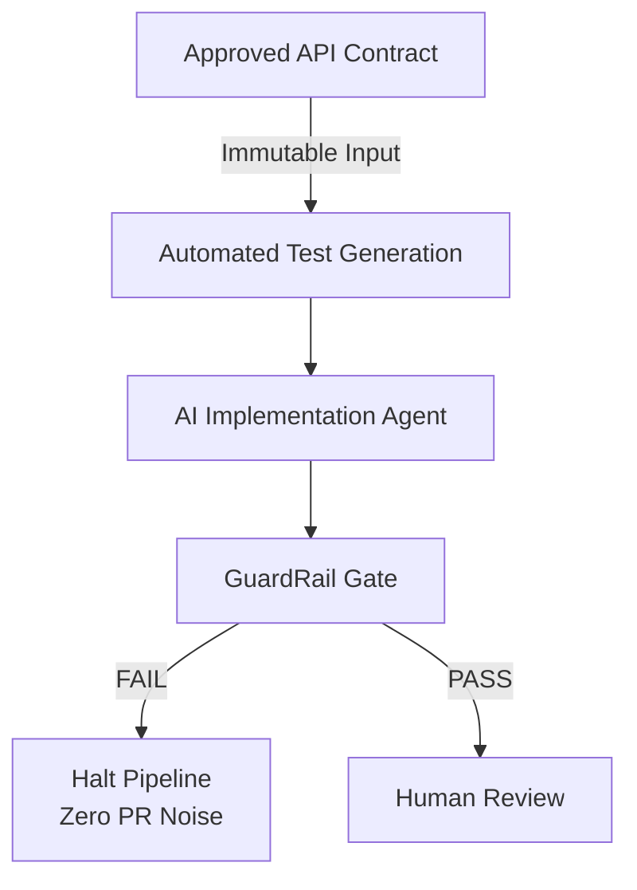
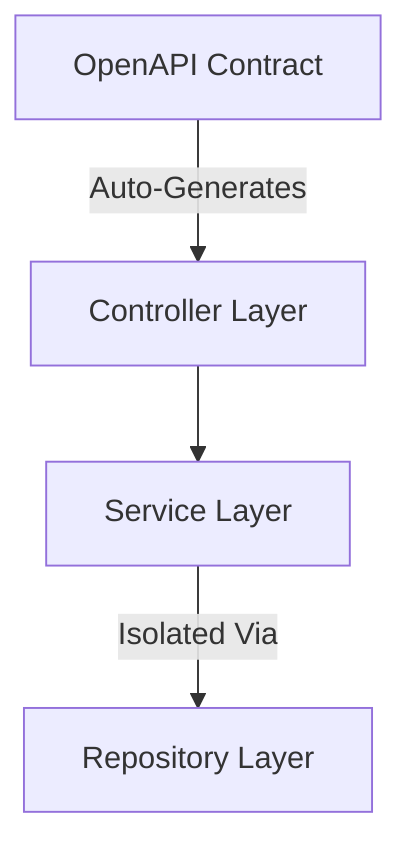
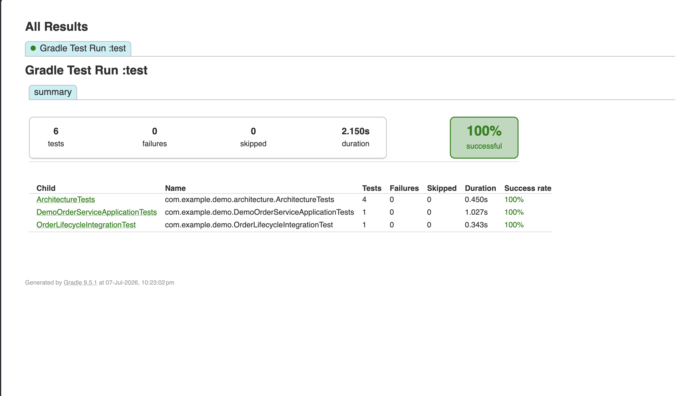
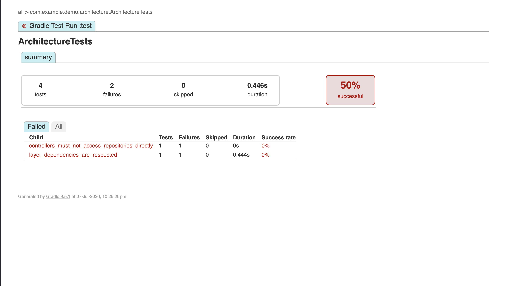

# GuardRail

Deterministic verification for AI-assisted software development.

GuardRail is a reference implementation of a contract-first, architecture-guarded verification pipeline. It demonstrates how to move deterministic code checks earlier into the development lifecycle, ensuring that AI coding agents (or developers) cannot introduce structural drift or break public API schemas - even if their code compiles perfectly.

---

## The Philosophy

AI assistants can generate thousands of lines of code in seconds, making human review the primary bottleneck in modern software engineering. 

GuardRail automates everything that can be verified deterministically, leaving human reviewers to focus exclusively on business intent, domain model correctness, and engineering judgment.


---

## Tech Stack and Architecture

- Runtime: Java 21
- Framework: Spring Boot 3.x (Web, Validation)
- Contract Engine: OpenAPI Spec (v3) + OpenAPI Generator Gradle Plugin
- Architecture Guard: ArchUnit 1.3.0
- Build Tool: Gradle 9.x (Kotlin DSL)

### Component Dependencies


---

## Getting Started

### Prerequisites
- Java 21 SDK
- A terminal to run Gradle commands

### Installation and Compilation
Clone the repository and run the initial compilation block. This will automatically execute the OpenAPI generator plugin to build the network DTOs and API interface stubs from order-api.yaml:

```bash
./gradlew compileJava
```
# GuardRail Verification Suite Execution Log

## 1. Clean Baseline Run (Success Verification)

When running the suite against a code structure that respects layered boundaries and fulfills the OpenAPI contract, the build compiles the code generation targets, processes the tests, and exits successfully.

### Command
```bash
./gradlew clean test
```


## 2. The Killer Feature: Architectural Breach Stopped Dead
To simulate structural drift, the repository layer was injected directly into the OrderController, bypassing the service layer entirely.

Although the application compiles without syntax errors and satisfies the endpoints, ArchUnit drops the hammer in less than a second, preventing the code from leaking into a pull request:

### Command
```bash
# Force failure by introducing a bypass dependency in OrderController
./gradlew test
```


### Core Architecture Guard Rules
The strict execution constraints verified inside ArchitectureTests.java include:

1. Layer Integrity: Controllers may only access Services. Services may only access Repositories.
2. No Shortcuts: No Controller class may bypass the service abstraction to talk to a Repository directly.
3. Unidirectional Flow: The Service layer is strictly detached from and cannot depend back on the Controller package.
4. Data Isolation: Generated OpenAPI network DTOs cannot bleed backward into the operation signatures of internal services.

### Success Criteria
A successful GuardRail installation guarantees:

- Zero PR noise for mechanical violations.
- Immediate isolation of code generation bugs.
- Contract stability via an unmodifiable single source of truth.
